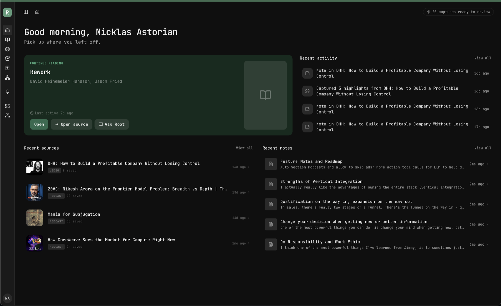
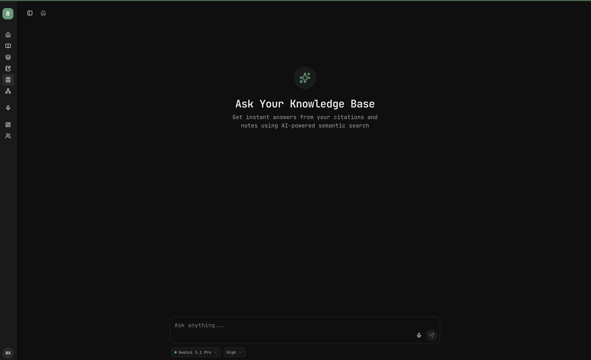

# Root

Root is a personal knowledge system built around one conviction: **spending time learning is only valuable if you actually retain what you learn.**

Books, podcasts, YouTube videos, PDFs, articles — all of it tends to scatter across highlights, tabs, and half-finished notes. Root gives it a single, queryable home, and is built on two principles:

1. **Learning requires reflection.** You retain ideas by condensing, articulating, and connecting them in your own words — not by passively consuming them.
2. **One home for everything.** Search across all your sources in natural language and surface connections you'd otherwise miss.

> Root doesn't do your thinking for you. It creates the conditions for you to think harder, deeper, and longer.

## Product Preview





## The Core Loop

1. **Capture** — upload and highlight PDFs, transcribe podcasts (AssemblyAI) and highlight straight from the transcript, import YouTube videos by URL, or paste citations manually.
2. **Synthesize** — each source gets a **maximum of five takeaways**. The limit is the point: deciding what actually mattered is where retention happens. Cross-source **notes** connect ideas that span books, podcasts, and conversations.
3. **Recall** — RAG queries against your whole library with grounded, cited answers; spaced repetition (SM-2) generated from your takeaways; hybrid semantic + full-text search for the things you half-remember.

## Architecture

| Service | Stack | Role |
|---------|-------|------|
| `frontend/` | Vite + React 19, TanStack Router, React Query, shadcn/ui | SPA — UI and client-side routing |
| `auth-server/` | Better-Auth on Hono/Bun | Sessions, JWTs, JWKS, user management; owns the `auth` schema |
| `fast-api/` | FastAPI + SQLAlchemy | The application backend: all CRUD, RAG, embeddings, LLM calls, external integrations |
| `go-api/` | Go + golang-migrate | Schema migration runner (applies `migrations/*.sql`, serves `/health`) — not in the request path |
| `nginx/` | Nginx | Ingress: routing, rate limiting, security headers |

- **Database:** PostgreSQL with `pgvector` (semantic search) and GIN/BM25 full-text search.
- **Auth:** the auth-server issues JWTs; FastAPI validates them via JWKS. No shared secrets.
- **Type safety:** FastAPI OpenAPI → orval → TypeScript, consumed by the frontend and the Expo mobile app (`mobile/`).
- **External services:** Voyage AI (embeddings), OpenAI / Gemini / Anthropic (LLMs), AssemblyAI (transcription), Cloudflare R2 (storage), Resend (email).

## Getting Started

Prerequisites: Docker, Node 20+/pnpm, Bun, Python 3.13+/uv, Go 1.23+.

```bash
git clone https://github.com/Dappner/root.git
cd root
cp .env.example .env        # fill in what you need; most AI keys are optional for basic use

make up                     # local stack via docker compose (nginx on :8000)
make migrate-up             # apply schema migrations
make seed-db                # optional: seed a local admin user
```

For iterating on a single service, run it directly (`pnpm dev` in `frontend/`, `uv run uvicorn app.main:app --reload --port 8081` in `fast-api/`, `bun run dev` in `auth-server/`). The Makefile wraps env injection with [Doppler](https://www.doppler.com/); without Doppler, export the variables from `.env` yourself.

## Documentation

- [`AGENTS.md`](AGENTS.md) — architecture overview, plus per-service guides in `frontend/`, `fast-api/`, `go-api/`, `mobile/`, `auth-server/`
- [Product overview](docs/product_overview.md) and [philosophy](docs/product_philosophy.md)
- [Review system (spaced repetition)](docs/review-system.md)
- [Podcast transcripts](docs/PODCAST_TRANSCRIPTS.md)

## License

Root is licensed under the [MIT License](LICENSE).

---

> **Root** — spend more time learning, remember more of what you learn, and see the connections between the things you know. Not an AI that thinks for you — a system that makes you think better.
